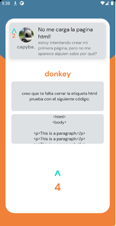

# StackOverPhoneApp
Android application developed in java that uses the Firebase technologies to store and provide data to the user. the app also uses interersting components such as Navigation Component, from Android Jetpack.

## Tools
|      Java       |  Firebase   |                 Android Studio                  |          Android Jetpack
|:-------------:|:------:|:--------------------------------------:|:--------------------------------------:|
 | |  | 

## Functioning
### Splash

This application has a splash screen to introduce the user to it.

 

### Home

The main screen of the app show a RecyclerView that lists the different questions that the user have uploaded. The list can be organized in different ways using the tab layout.

 

### Navigation

Using the navigation component into a bottom menu component, the user can go through the different main screens, such as "Search", "Profile" or "About"

### Other Screens

There are other screens related with the Questions and the answers of the users.

  #### Displayed question
  
  
  
  
  #### Displayed answer
  
   
  
  ## Video Demonstration

https://user-images.githubusercontent.com/99197513/189766922-2931c8f2-754c-4894-b50b-01be45524a1b.mp4

